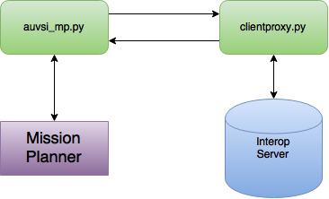

# Interop Scripts

Client-side scripts that must be run to successfully interact with the Interoperability server.

## Mission Planner -- SDA, telemetry upload

The Mission Planner scripts allow MPI (Mission Planner) to interact with the Interoperability server. The script that needs to be run within Mission Planner is ```auvsi_mp.py```

The system is the following:



## Central script

The ```clientproxy.py``` script handles all communication between the TRA and MP scripts with the Interoperability server.

## TRA -- Actionable Intelligence, Emergent Target, ADLC

The TRA script allows the drone to communicate with the Interoperability server and submit target data. To run the Target Recognition Application, the script ```tra.py``` is used.

The system is the following:


