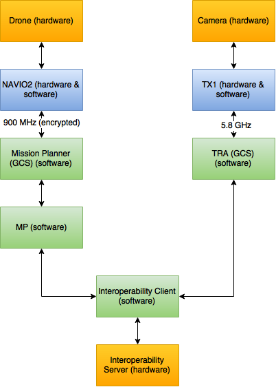

System
======

The system is broken down into numerous parts. The architecture for the system as a whole is as follows:

Each section in the above image will be discussed in more detail in the following pages.

#. :doc:`hardware`.
   Understanding the hardware is a key requirement before being able to successfully develop with the system.
#. :doc:`navio2`.
   The NAVIO2 is the brain of the of drone and combines both hardware and software aspects from the competition.
#. :doc:`tx1`.
   The TX1 completes all image processing onboard the drone.
#. :doc:`missionplanner`.
   Ground Control Station software for controlling the drone.
#. :doc:`mp`.
   This is a script which runs within MissionPlanner that interfaces with the interoperability client to both send and receive data from the interoperability server.
#. :doc:`tra`.
   The Target Recognition Application is in charge of submitting targets to the interoperability server.
#. :doc:`interoperabilityclient`.
   This allows the TRA and MP scripts to communicate with the interoperability server.

--------------

.. toctree::
  :hidden:

  hardware
  navio2
  tx1
  missionplanner
  mp
  tra
  interoperabilityclient
